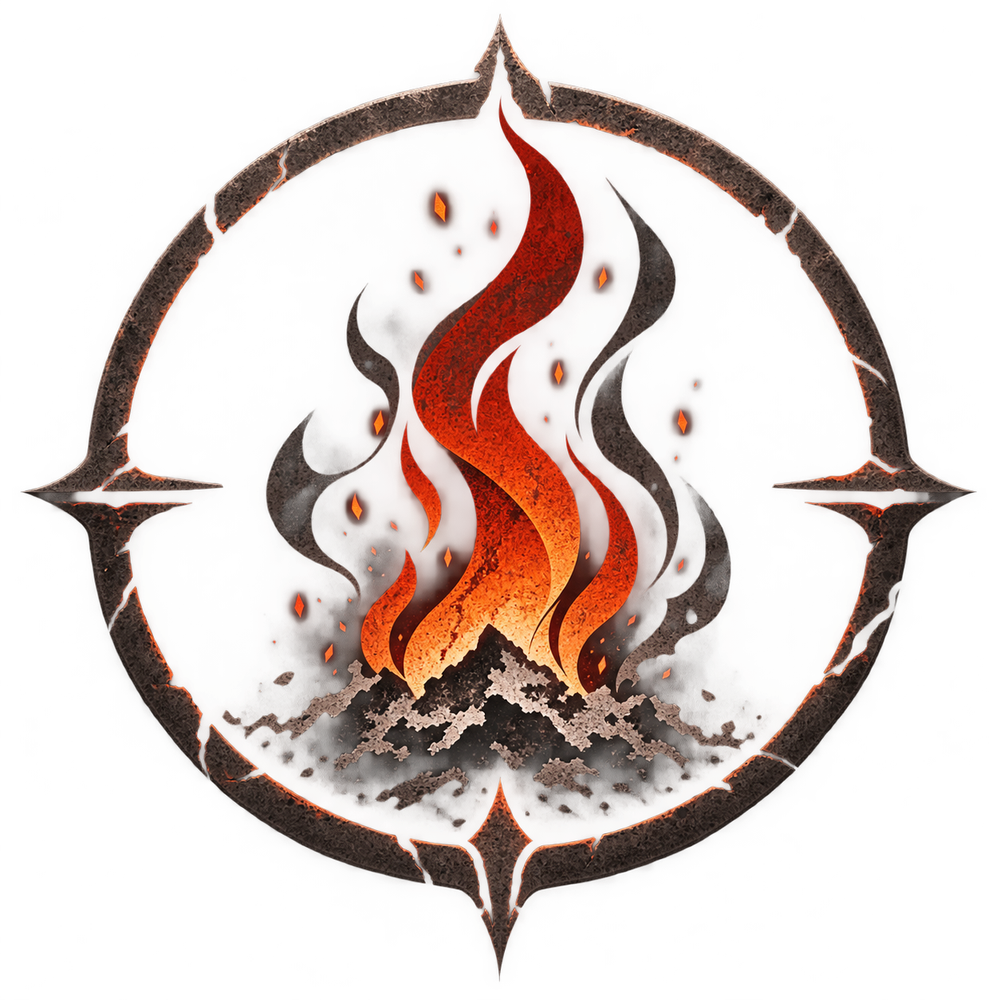

<p align="center">
  
</p>

# Cinder Ash 0.01

A new KDE Plasma 6 theme by [MisterKnot](https://github.com/MisterKnot), using nine colors inspired by Dark Souls. 

You can find screenshots at [opendesktop.org](https://www.opendesktop.org/p/2374400/)

## Included

KDE color scheme, Kvantum application style, Plasma panels and widgets, Aurorae window decorations, original 4K wallpaper, startup splash, lock-screen wallpaper/palette integration, and an original Qt 6 SDDM login theme. Icons, cursors, fonts, panel placement and desktop layout remain yours. Standard window decoration controls are included.

The lock screen uses KDE’s existing authentication interface with the new wallpaper and complementary palette. It does not replace KDE’s authentication code. GTK-specific application styling is not included; applications that ignore KDE’s palette may retain their own appearance.

## Install

Requirements: KDE Plasma 6, Aurorae window decorations, Python 3, the **Qt 6 Kvantum style and Kvantum Manager**. SDDM additionally requires the Qt 6 greeter (`sddm-greeter-qt6`) and Qt Quick Controls. Package names vary by distribution. The tested environment was Plasma 6.6.6, Qt 6.10.2, Kvantum 1.1.5 and SDDM 0.21.

Clone this repository or extract the release ZIP, open a terminal in the theme directory, then run as your normal desktop user:

```sh
git clone https://github.com/MisterKnot/Cinder-Ash-KDE-theme.git
cd Cinder-Ash-KDE-theme
```

```sh
./install.sh
```

Restart applications and log out/back in to reload all appearance settings. If automatic wallpaper activation is unavailable, select Cinder Ash in desktop Wallpaper settings. The installer preserves existing unrelated settings and records backups before applying the theme.

Preview the login theme from a terminal in the extracted folder:

```sh
sddm-greeter-qt6 --test-mode --theme "$PWD/sddm/CinderAsh"
```

Apply the SDDM theme separately:

```sh
sudo ./install-sddm.sh
```

This changes only `Theme/Current` in `/etc/sddm.conf` and installs the named SDDM theme. SDDM is not restarted; the appearance takes effect at the next login screen. Preview mode does not test actual authentication.

## Remove and restore

Keep the extracted package to run:

```sh
./uninstall.sh
sudo ./uninstall-sddm.sh
```

The installers retain the first backup across repeat installations. Desktop records and backups are under `${XDG_STATE_HOME:-$HOME/.local/state}/cinder-ash`; SDDM records and backups are under `/var/lib/cinder-ash`. JSON records identify each original configuration and backup file.

If any managed configuration file has changed since installation, removal stops before restoring or deleting anything. Review the listed files and saved backups manually; do not overwrite newer preferences blindly. Modified theme files are retained. After successful desktop removal, log out/back in. SDDM removal does not restart the display manager.

When present, the specifically marked Ambinance Classic file-picker service override is disabled while installing Cinder Ash and restored on removal. Its original theme files remain intact. This may restart the running KDE file-picker service, so close open file dialogs before installing or removing.

## Colors

| Role | Color |
| --- | --- |
| Background — Charred Greatsword | `#151313` |
| Surface — Ashen Plate | `#2A2421` |
| Border — Burnt Iron | `#4A3E3D` |
| Deep accent/selection — Smoldering Crimson | `#8B0000` |
| Primary accent — Cinder Flame | `#C23B22` |
| Active accent — Kiln Ember | `#FF4500` |
| Highlight — Sunlight Remnant | `#E0A96D` |
| Text — Pale Ash | `#E4DDD5` |
| Muted text — Cold Ash | `#A59D98` |

Warm-white text sits on charcoal surfaces and crimson selections. Bright orange action buttons use dark text. Native symbolic toolbar icons inherit the dark application palette.

See [ABOUT.md](ABOUT.md), [CHANGELOG.md](CHANGELOG.md), [VALIDATION.md](VALIDATION.md) and [THIRD-PARTY.md](THIRD-PARTY.md). Run `./about.sh` for identity and version information. Original work is GPL-3.0-or-later; bundled upstream assets retain the licenses documented in THIRD-PARTY.md and LICENSES.
